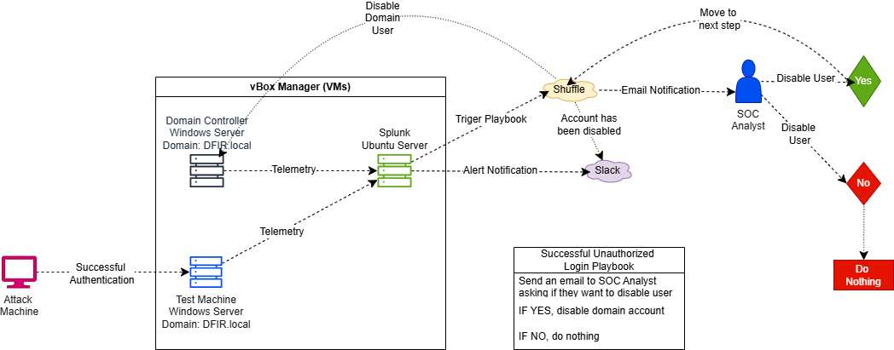

**# Active Directory Project**

**## Part 1: Logical Diagram**

**### Objective**

**Create an Active Directory environment in Draw.io, integrating all core components and their connectivity so I can automate responsive actions.**

**### Skills Learned**

**- Active Directory architecture design**

**- SIEM integration planning (Splunk)**

**- SOAR workflow mapping (Shuffle)**

**- Security telemetry flow design**

**- Infrastructure visualization using Draw.io**

**### Tools**

**- Draw.io**

**### Steps**

**Ref 1: Network Diagram**

****

