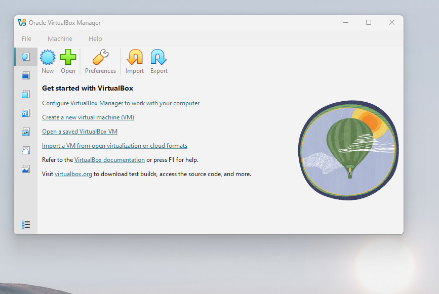
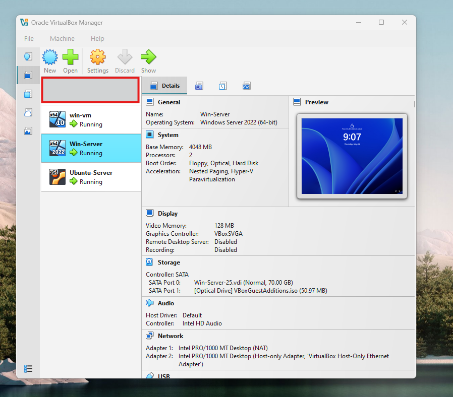
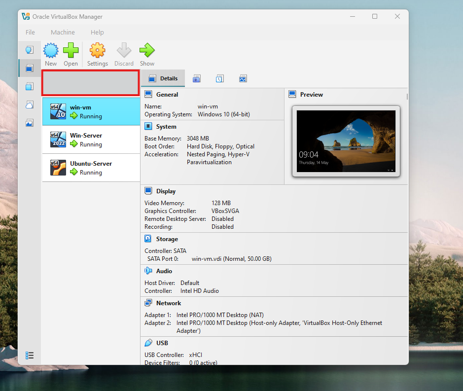
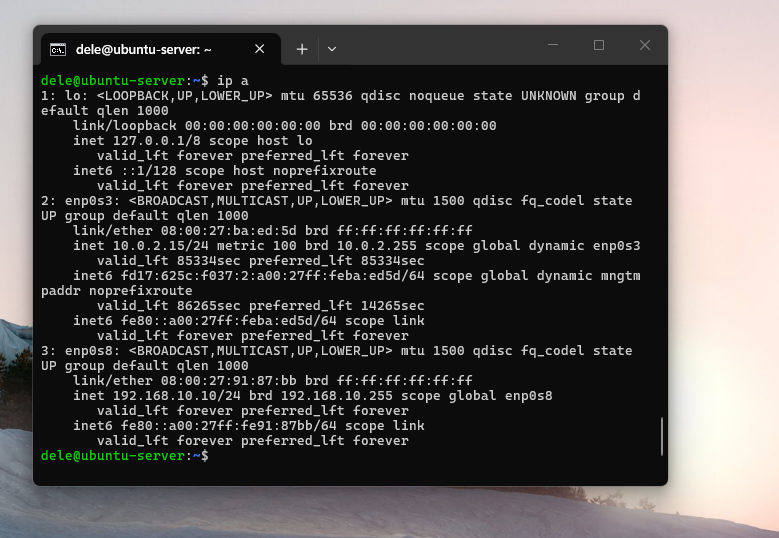
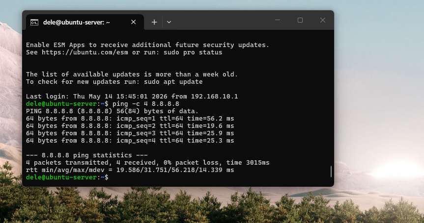
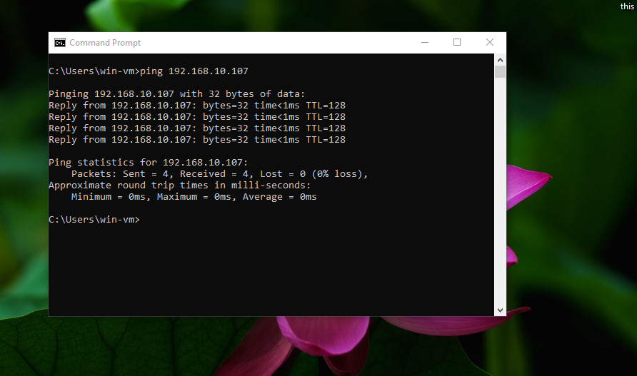

# PART 2
Transition from architecture/design into infrastructure deployment and network validation.

## Objective
Deploy and configure a 3-VM environment in Oracle VM VirtualBox to simulate an enterprise network supporting AD, SIEM (Splunk), and internal communication testing.

### Skills Learned
- Virtual machine provisioning and resource allocation in VirtualBox.
- Dual-network architecture (NAT + Host-Only) design and implementation.
- Remote administration via SSH for Linux-based security servers.
- Network interface analysis using ip a and ipconfig across different OSs.
- Connectivity validation for both external internet access and internal segmentation.
- Multi-VM environment preparation for AD, SIEM, and workstation integration.

### Tools
- Oracle VM VirtualBox Manager (Hypervisor)
- Windows Server 2022 (Domain Controller ISO)
- Windows 10 (Workstation ISO)
- Ubuntu Server 24.04 LTS (Splunk Host ISO)
- OpenSSH / SSH Client (Remote Administration)
- Command Prompt / PowerShell (Windows Connectivity Testing)
- Bash Terminal (Linux Connectivity Testing)

### Steps

Ref 1: Network Diagram  
This diagram illustrates the logical architecture of the lab, showcasing the isolation between the NAT and Host-Only networks.

Ref 2: VirtualBox Lab Overview  
A high-level view showing the three core virtual machines—DFIR-DC01, WIN-TEST01, and DFIR-Splunk—running simultaneously within the VirtualBox manager.

Ref 3: Windows Server (DC) Configuration  
Deployment of the Windows Server 2022 Domain Controller (DFIR-DC01) with 2 vCPUs and 4GB RAM, configured for the DFIR.local domain.

Ref 4: Windows 10 Test Machine Deployment  
Configuration of the WIN-TEST01 workstation used for endpoint activity simulation and testing connectivity within the domain.

Ref 5: Ubuntu Server Interface Verification  
Verification of the dual-network configuration using `ip a`. The NAT interface provides internet access while the Host-Only interface enables internal lab communication.

Ref 6: Ubuntu SSH Access & External Connectivity  
Demonstration of SSH-based remote administration of the CLI-only Ubuntu server and successful external ICMP reachability to 8.8.8.8.

Ref 7: Internal Connectivity Test (ICMP)  
Successful internal ping test between WIN-TEST01 and DC01 with 0% packet loss, confirming correct subnet alignment and VM-to-VM communication.

